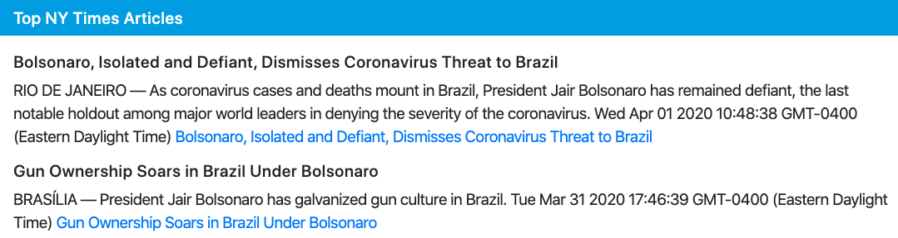
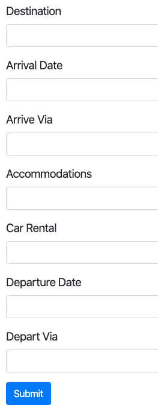

## What it does

Vacay is an app that provides travelers with a snapshot of information about countries they plan to visit. The categories of information offered using API connections are basic country statistics, a dynamic map (Google), weather (AccuWeather), and currency (DataFixer). A New York Times API provides 5 articles pertaining to the selected country. An itinerary form allows the user to store information about their trip plans.

## How it works

After clicking "Let's Go" in the splash page, the app presents a search box to enter a country, or a city. Once a search occurs, all the categories of country information are returned and displayed.

### Search

The user can enter a city or country and Google will list matching search terms from its database. After setting the search query, press the Return key or click the __Search__ button.

### Country data

__Country stats.__ Lists basic information and statistics, such as language, population, capitol city, bordering countries, and currency.

__Weather.__ The weather's geographic location is the region of the capitol city. The user can switch between Metric and Imperial measurements, i.e., Celsius versus Fahrenheit temperatures, kilometers versus miles.

__Currency.__ The country's currency rate is measured against the US dollar. The user can actually select their own base and target rate currencies. The currency calculator applies the current base/target currencies.

### News

Five New York Times articles are returned from the country search query. These are intended to give the user current information that may be relevant to their travels.

### Itinerary

Click __Add Itinerary__ button to create an itinerary item.

Click __Submit__ to save the itinerary item.

Other buttons to click are:

__Remove All__. Removes all itinerary items from the Firebase database.

__Hide Form__. Hides the form to reduce the size of the web page.

## Technology

There are four API's at work in this web app.

1) Country Data. https://restcountries.eu

2) Google Maps. https://www.google.com/maps

3) AcccuWeather. https://dataservice.accuweather.com.

4) Currency. https://data.fixer.io.

The itinerary uses Google's Firebase noSQL database.

The URL to the app is https://alanleverenz.github.io/Vacay/
